<p align="center">
  <a href="https://github.com/Razen04/GateQuest">
    
  </a>
</p>

<h1 align="center">GATEQuest</h1>

<p align="center">
  A modern, open-source GATE exam practice and preparation app designed to help you ace your exams.
  <br />
  <a href="https://gate-quest.vercel.app">Website</a>
  ·
  <a href="https://discord.gg/dFmg3g52c5">Discord</a>
  ·
  <a href="https://gate-quest.vercel.app/donate">Donate</a>
  ·
  <a href="https://github.com/Razen04/GateQuest/issues">Report Bug</a>
  ·
  <a href="https://github.com/Razen04/GateQuest/issues">Request Feature</a>
</p>

<p align="center">
  <a href="https://gate-quest.vercel.app"></a>
  <a href="https://github.com/Razen04/GateQuest/stargazers"></a>
  <a href="https://github.com/Razen04/GateQuest/network/members"></a>
  <a href="https://github.com/Razen04/GateQuest/blob/master/LICENSE"></a>
  <br />
  
  
  
  
</p>

---

## About The Project

GATEQuest is a feature-rich, user-friendly application built to provide a comprehensive and engaging platform for GATE exam aspirants. It offers a clean, modern interface with a focus on usability and performance.

<details open>
<summary>Screenshots</summary>
<br>
<p align="center">
  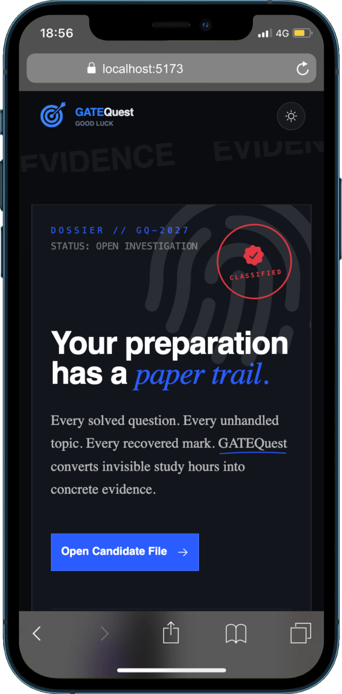
  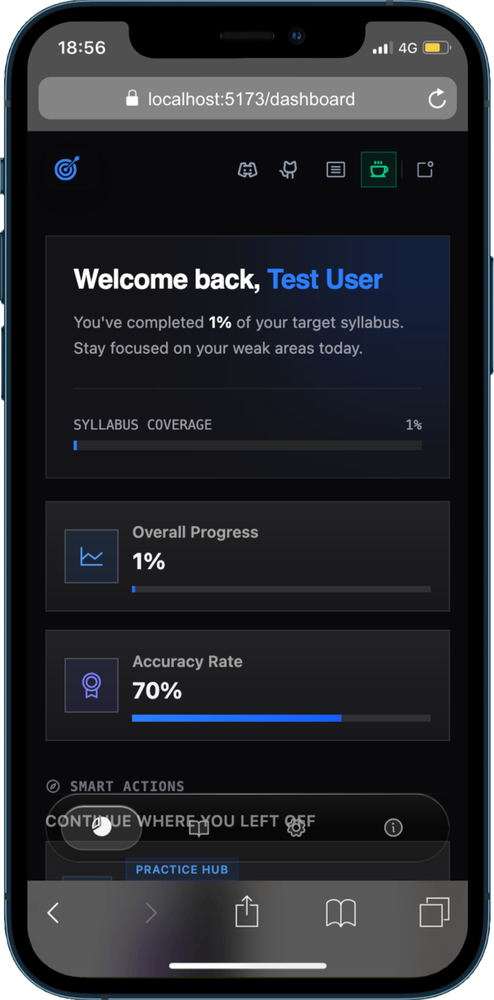
</p>
<p align="center">
  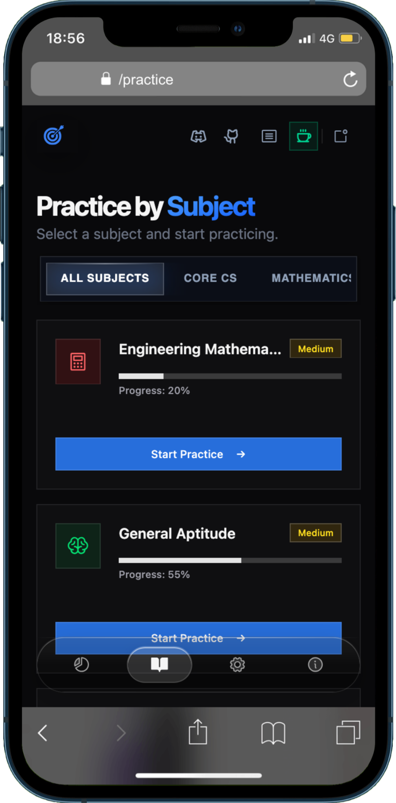
  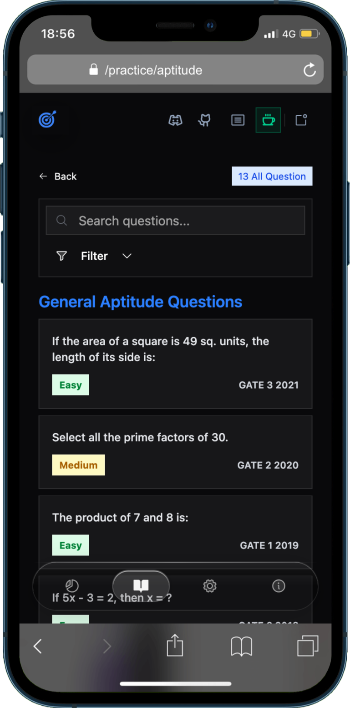
</p>

<p align="center">
  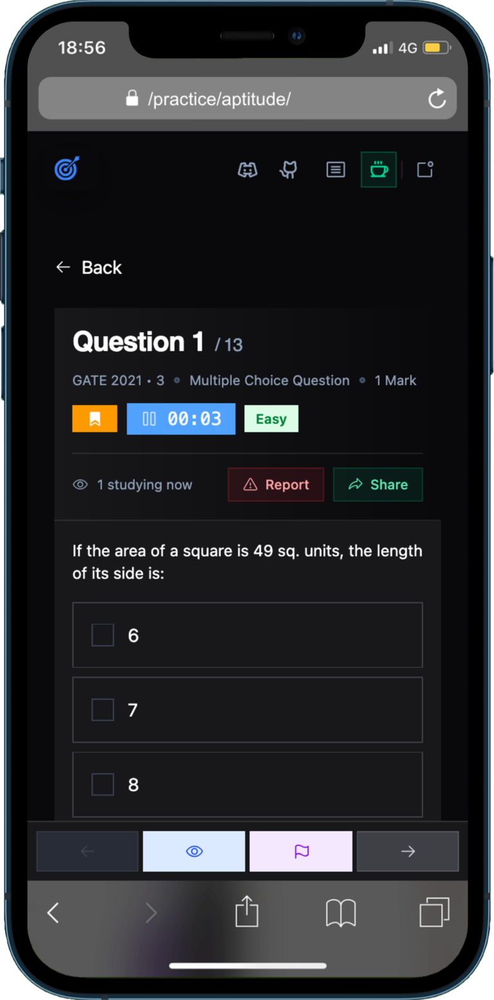
  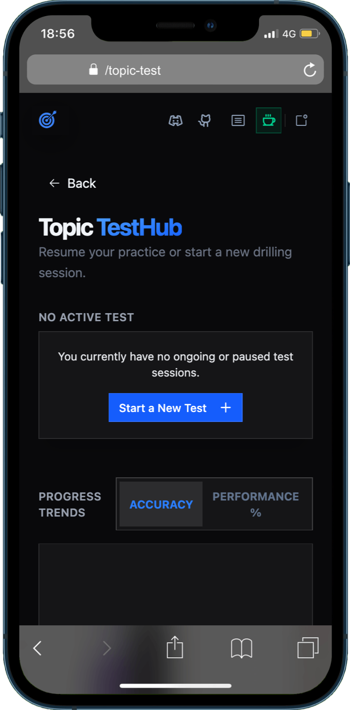
  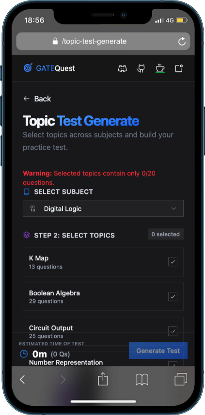
</p>

<p align="center">
  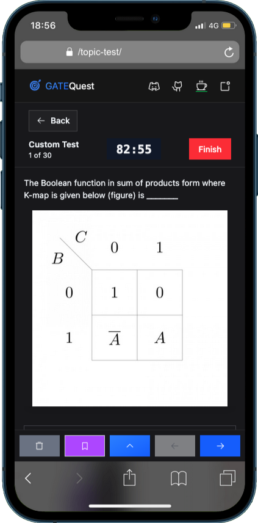
  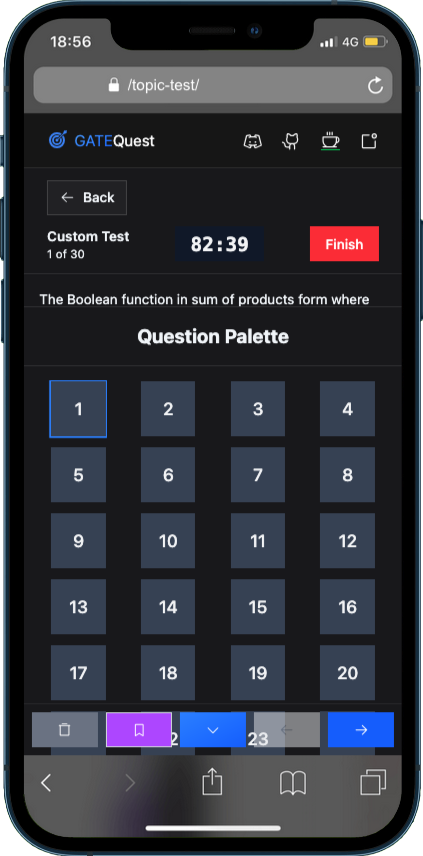
  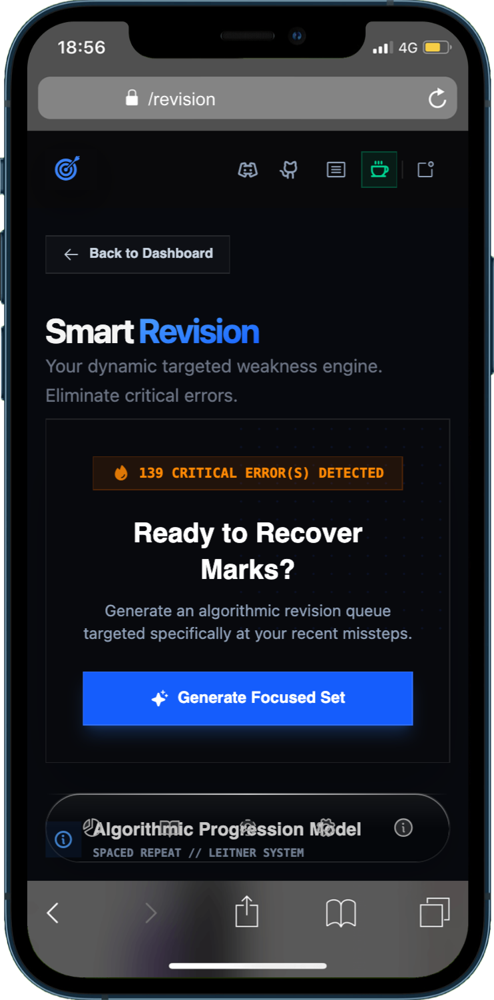
</p>

<p align="center">
  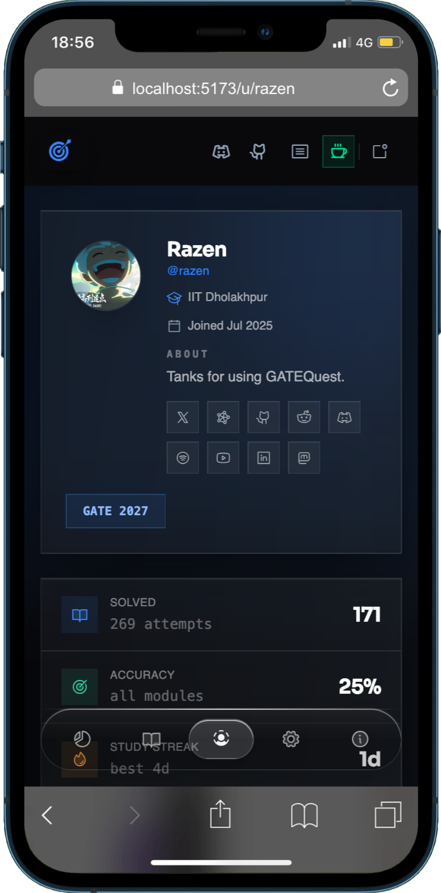
  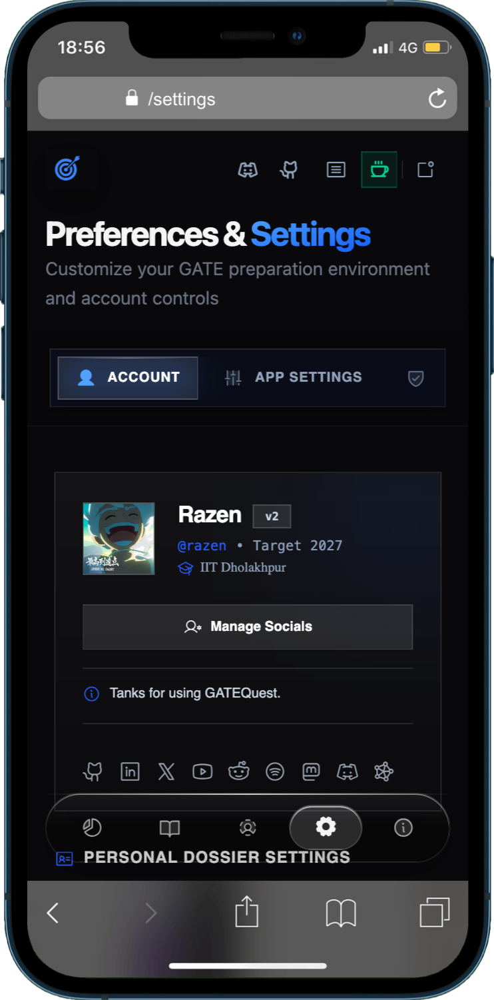
</p>
<p align="center">
  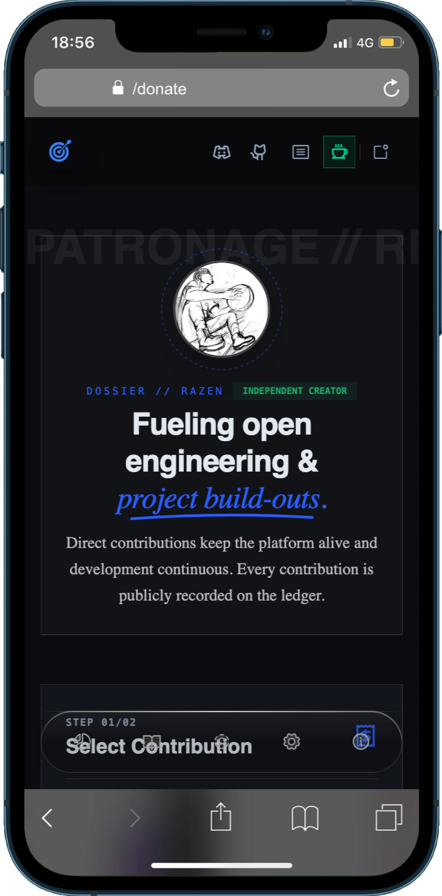
  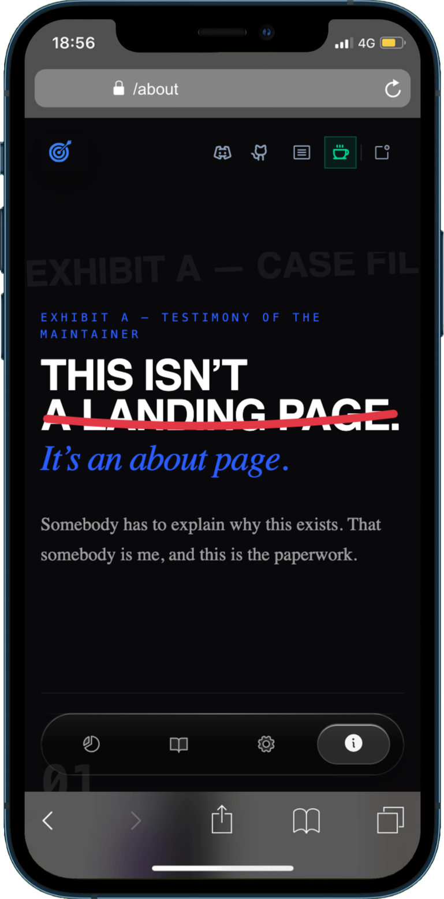
</p>

</details>

## Features

- **Interactive Dashboard**: Track your preparation with a **Target Study Roadmap** and a GitHub-style **Streak Graph** that visualizes your daily questions solved and practice consistency.
- **Practice Questions**: Access a vast library of GATE and ISRO PYQs across multiple branches (**CS, DA, EC, EE, ME, XL**), neatly organized by subject, year, and difficulty.
- **Multi-Branch Support**: Seamlessly switch between target branches, with universal subjects (like General Aptitude) dynamically syncing your progress and mistakes across your goals.
- **Bookmarking**: Save challenging questions with custom notes for later review and focused practice.
- **Performance Tracking**: Monitor your progress with detailed statistics on accuracy and overall completion rate.
- **Smart Revision**: Use the Leitner System to effectively revise weak topics with auto-generated weekly recovery sets.
- **Topic Tests**: Test your knowledge in a timed environment targeted at specific topics.
- **AskAI**: Instant AI assistance for step-by-step question breakdown and doubt clearing for _FREE_.
- **Built-in Timer**: Simulate real exam conditions with an automatic timer for each question.
- **User Profile `[Beta]`**: Share your public profile with friends and aspirants.(currently in beta).
- **Light & Dark Modes**: Switch between light and dark themes for a comfortable viewing experience.
- **Audio Feedback**: Get instant audio feedback cues for correct and incorrect answers.
- **Secure Authentication**: Sign in safely with your Google account, powered by Supabase.
- **Cloud Sync**: Seamlessly sync your progress and profile across all your devices.
- **PWA Support**: Install GATEQuest as a Progressive Web App for a full desktop/native app experience.

## Tech Stack

| Category             | Technology                                                                                                                                                                                                                                                                                                                                        |
| -------------------- | ------------------------------------------------------------------------------------------------------------------------------------------------------------------------------------------------------------------------------------------------------------------------------------------------------------------------------------------------- |
| **Language**         |                                                                                                                                                                                                                           |
| **Frontend**         |    |
| **Backend & Auth**   |                                                                                                                                                                                                                                        |
| **Deployment**       |                                                                                                                                                                                                                                       |
| **State Management** |                                                                                                                                                                                                                                           |
| **Offline Storage**  |                                                                                                                                                                                                                                                              |
| **Animations & UI**  |                                                                                                                                                      |

## Project Structure

```
GateQuest/
├── public/                         # Static assets
│   ├── ai_providers/               # AI provider logos
│   ├── audio/                      # App sound effects
│   ├── icons/                      # PWA icons & branding
│   └── screenshots/                # app screenshots
│
├── src/
│   ├── app/                        # App entry, layout, routing, providers
│   │   ├── layout/                 # Navbar, sidebar, responsive layout
│   │   ├── providers/              # Global React context providers
│   │   └── routes/                 # Route definitions
│   │
│   ├── features/                   # Feature-based architecture
│   │   ├── dashboard/              # Stats, streaks, study plan
│   │   ├── practice/               # Practice question flow
│   │   ├── questions/              # Question engine & renderers
│   │   ├── smart-revision/         # Weekly smart revision system
│   │   ├── topic-test/             # Topic-wise test engine
│   │   ├── auth/                   # Authentication
│   │   ├── settings/               # User/app settings
│   │   ├── donations/              # Donation system
│   │   ├── landing/                # Landing page
│   │   └── about/                  # About page
│   │
│   ├── shared/                     # Shared reusable code
│   │   ├── api/                    # Shared API utilities
│   │   ├── components/             # Reusable UI components
│   │   │   └── ui/                 # Base UI primitives
│   │   ├── hooks/                  # Global reusable hooks
│   │   ├── data/                   # Static configs/data/constants
│   │   ├── types/                  # Global TypeScript types
│   │   └── utils/                  # Shared utility functions
│   │
│   └── storage/                    # Local storage/repository layer
│
├── supabase/                       # Backend & database layer
│   ├── migrations/                 # SQL migrations & RPC functions
│   ├── snippets/                   # SQL experimentation snippets
│   ├── config.toml                 # Supabase config
│   └── seed.sql                    # Seed data
│
├── .github/                        # GitHub templates/config
├── .husky/                         # Git hooks
│
├── README.md                       # Project documentation
├── CONTRIBUTING.md                 # Contribution guide
├── CODE_OF_CONDUCT.md              # Community guidelines
├── CHANGELOG.md                    # Release history
│
├── package.json                    # Dependencies & scripts
├── vite.config.ts                  # Vite configuration
├── vitest.config.ts                # Vitest configuration
├── eslint.config.ts                # ESLint configuration
└── tsconfig.json                   # TypeScript configuration
```

## Getting Started

To get a local copy up and running, follow these simple steps.

### Prerequisites

- [Node.js](https://nodejs.org/en/) (v18.x or later)
- [npm](https://www.npmjs.com/)
- [Docker Desktop](https://www.docker.com/products/docker-desktop/) (required for local Supabase emulator)
- [Supabase CLI](https://supabase.com/docs/guides/cli)

### Installation

1.  **Clone the repository:**
    ```sh
    git clone https://github.com/Razen04/GateQuest.git
    cd GateQuest
    ```
2.  **Install dependencies:**
    ```sh
    npm install
    ```
3.  **Set up local Supabase instance:**
    - Start the Supabase services (need Docker installed, read more about it in the guide):
      ```sh
      supabase start
      ```
      _OR_
      ```sh
      npm run supabase:start
      ```
    - The CLI will output your local Supabase URL, anon key, and service role key.
    - Read more about the Supabase Setup in [SUPABASE_GUIDE](SUPABASE_GUIDE.md)
    - Read more about the Supabase Documentation of the project in [SUPABASE_DOCS](SUPABASE_DOCUMENTATION.md)
4.  **Set up environment variables:**
    - Create a `.env` file in the root directory.
    - Add your Supabase project URL and anon key:
      ```env
      VITE_SUPABASE_PROJECT_URL=your_supabase_url
      VITE_SUPABASE_ANON_PUBLIC_KEY=your_supabase_anon_key
      ```
5.  **Run the development server:**
    ```sh
    npm run dev
    ```
6.  **Run Tests:**
    ```sh
    npm run test
    ```
7.  **Build for production:**
    ```sh
    npm run build
    ```

### Available Scripts

- `npm run dev`: Starts the development server.
- `npm run build`: Builds the app for production.
- `npm run lint`: Lints the codebase using ESLint.
- `npm run format`: Formats the code using Prettier.
- `npm run test`: Runs tests using Vitest.
- `npm run supabase:start`: Starts the local Supabase Docker container.
- `npm run supabase:stop`: Stops the local Supabase Docker container.

## Contributing

Contributions are what make the open-source community such an amazing place to learn, inspire, and create. Any contributions you make are **greatly appreciated**.

If you have a suggestion that would make this better, please fork the repo and create a pull request. You can also simply open an issue with the tag "enhancement".

1.  Fork the Project
2.  Create your Feature Branch (`git checkout -b feature/AmazingFeature`)
3.  Commit your Changes (`git commit -m 'Added some AmazingFeature'`)
4.  Push to the Branch (`git push origin feature/AmazingFeature`)
5.  Open a Pull Request

Please read our [Contributing Guidelines](CONTRIBUTING.md) and [Code of Conduct](CODE_OF_CONDUCT.md) for more information.

## License

Distributed under the MIT License. See [LICENSE](LICENSE) for more information.
