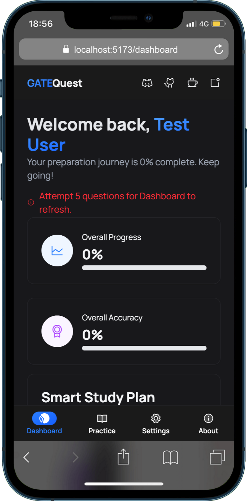
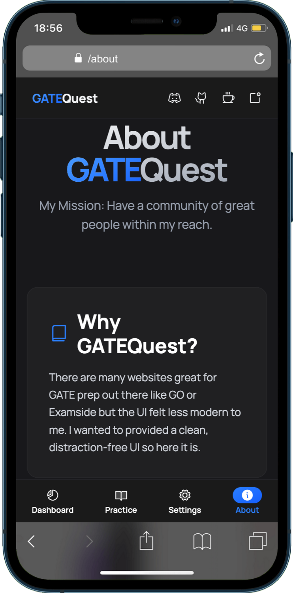

<div align="center">
  <a href="https://github.com/Razen04/GateQuest">
    
  </a>
  <h1 align="center">GATEQuest</h1>
  <p align="center">
    A modern, open-source GATE exam practice and preparation app designed to help you ace your exams.
    <br />
    <a href="https://gatequest.vercel.app/">View Demo</a>
    ·
    <a href="https://github.com/Razen04/GateQuest/issues">Report Bug</a>
    ·
    <a href="https://github.com/Razen04/GateQuest/issues">Request Feature</a>
  </p>
</div>

<div align="center">

[](https://github.com/Razen04/GateQuest/stargazers)
[](https://github.com/Razen04/GateQuest/network/members)
[](https://github.com/Razen04/GateQuest/blob/master/LICENSE)

</div>

---

## About The Project

GATEQuest is a feature-rich, user-friendly application built to provide a comprehensive and engaging platform for GATE exam aspirants. It offers a clean, modern interface with a focus on usability and performance.

<details>
<summary>📸 Screenshots</summary>
<br>
<table>
  <tr>
    <td></td>
    <td></td>
  </tr>
  <tr>
    <td></td>
    <td></td>
  </tr>
   <tr>
    <td></td>
    <td></td>
  </tr>
</table>
</details>

## ✨ Features

- 📝 **Practice Questions**: Access a vast library of GATE questions, neatly organized by subject, year, and difficulty.
- 🔖 **Bookmarking**: Save challenging questions for later review and focused practice.
- 📊 **Performance Tracking**: Monitor your progress with detailed statistics on accuracy and study time.
- ⏱️ **Built-in Timer**: Simulate exam conditions with an automatic timer for each question.
- 🎨 **Light & Dark Modes**: Switch between themes for a comfortable viewing experience.
- 🔊 **Audio Feedback**: Get instant sound cues for correct and incorrect answers.
- 🔐 **Secure Authentication**: Sign in safely with your Google account, powered by Supabase.
- ☁️ **Cloud Sync**: Your progress and profile are securely synced across devices.
- 📱 **PWA Support**: Install GATEQuest as a Progressive Web App for offline access.
- ↔️ **Collapsible Sidebar**: Minimize distractions and focus on what matters most.

## 🛠️ Tech Stack

| Category                 | Technology                                                                                                                                                                                                                                                                                                                                                                                                                                                                 |
| ------------------------ | -------------------------------------------------------------------------------------------------------------------------------------------------------------------------------------------------------------------------------------------------------------------------------------------------------------------------------------------------------------------------------------------------------------------------------------------------------------------------- |
| **Frontend**             |     |
| **Backend**              |                                                                                                                                                                                                                                                                                                                                                                 |
| **State Management**     |                                                                                                                                                                                                                                                                                                                                                                        |
| **Testing**              |                                                                                                                                                                                                                 |
| **Animations**           |                                                                                                                                                                                                                                                                                                                                                                        |
| **Linting & Formatting** |                                                                                                                                                                                                                                                     |
| **Icons**                |                                                                                                                                                                                                                                                                                                                                                                                   |

## 📂 Project Structure

```
GateQuest/
├── public/                # Static assets (logo, sounds, favicons)
├── src/
│   ├── __tests__/         # Vitest tests
│   ├── components/        # Reusable React components
│   ├── context/           # React Context providers
│   ├── data/              # Static data (FAQs, subjects)
│   ├── hooks/             # Custom React hooks
│   ├── pages/             # Top-level page components
│   ├── routes/            # Route definitions
│   ├── types/             # TypeScript types and interfaces
│   ├── utils/             # Utility functions
│   ├── App.tsx            # Main application component
│   ├── main.tsx           # Application entry point
│   └── index.css          # Global and Tailwind CSS styles
│   ├── helper.ts          # Helper functions which are used throughout app
│   └── setupTests.ts      # Vitest setup
├── supabase/              # Supabase local development configuration
├── .github/               # GitHub-specific files (workflows, templates)
├── .husky/                # Husky pre-commit hooks
├── eslint.config.ts       # ESLint configuration
├── tsconfig.json          # TypeScript configuration
├── vite.config.ts         # Vite configuration
├── package.json           # Project dependencies and scripts
└── README.md              # This file
```

## 🚀 Getting Started

To get a local copy up and running, follow these simple steps.

### Prerequisites

- [Node.js](https://nodejs.org/en/) (v18.x or later)
- [npm](https://www.npmjs.com/)
- [Supabase CLI](https://supabase.com/docs/guides/cli)

### Installation

1.  **Clone the repository:**
    ```sh
    git clone https://github.com/Razen04/GateQuest.git
    cd GateQuest
    ```
2.  **Install dependencies:**
    ```sh
    npm install
    ```
3.  **Set up local Supabase instance:**
    - Start the Supabase services:
        ```sh
        supabase start
        ```
    - The CLI will output your local Supabase URL, anon key, and service role key.
    - Read more about the Supabase Setup in [SUPABASE_GUIDE](SUPABASE_GUIDE.md)
    - Read more about the Supabase Documentation of the project in [SUPABASE_DOCS](SUPABASE_DOCUMENTATION.md)
4.  **Set up environment variables:**
    - Create a `.env` file in the root directory.
    - Copy the local Supabase credentials into it:
        ```env
        VITE_SUPABASE_PROJECT_URL=your_local_supabase_url
        VITE_SUPABASE_ANON_PUBLIC_KEY=your_local_supabase_anon_key
        ```
5.  **Run database migrations:**
    ```sh
    supabase db reset
    ```
6.  **Run the development server:**
    ```sh
    npm run dev
    ```

### Available Scripts

- `npm run dev`: Starts the development server.
- `npm run build`: Builds the app for production.
- `npm run lint`: Lints the codebase using ESLint.
- `npm run format`: Formats the code using Prettier.
- `npm test`: Runs tests using Vitest.
- `npm run supabase:start`: Starts the local Supabase Docker container.
- `npm run supabase:stop`: Stops the local Supabase Docker container.

## 🤝 Contributing

Contributions are what make the open-source community such an amazing place to learn, inspire, and create. Any contributions you make are **greatly appreciated**.

If you have a suggestion that would make this better, please fork the repo and create a pull request. You can also simply open an issue with the tag "enhancement".

1.  Fork the Project
2.  Create your Feature Branch (`git checkout -b feature/AmazingFeature`)
3.  Commit your Changes (`git commit -m 'Added some AmazingFeature'`)
4.  Push to the Branch (`git push origin feature/AmazingFeature`)
5.  Open a Pull Request

Please read our [Contributing Guidelines](CONTRIBUTING.md) and [Code of Conduct](CODE_OF_CONDUCT.md) for more information.

## 📜 License

Distributed under the MIT License. See [LICENSE](LICENSE) for more information.
